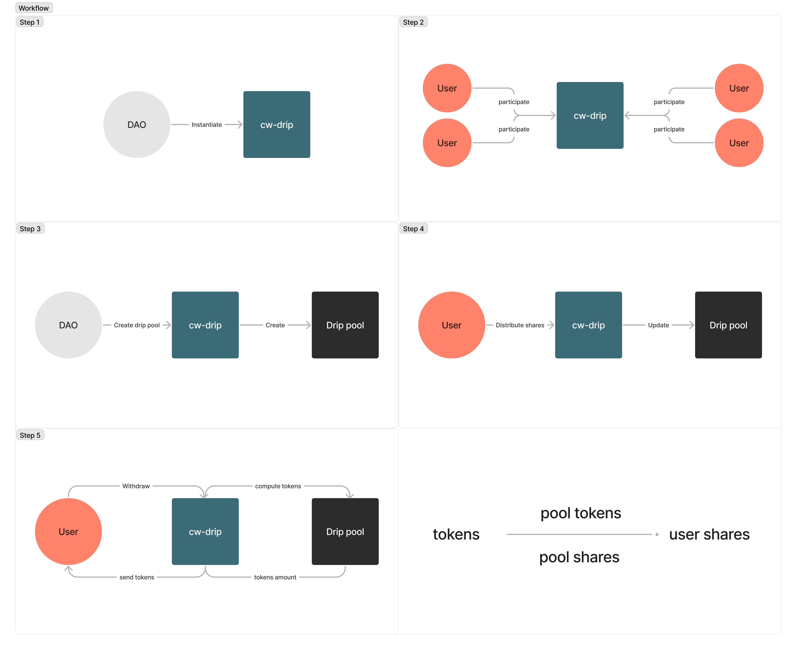

# CosmWasm Drip

This is a minimal implementation of a __Community DAO Incentive Contract__. The contract allows any _native_ or _cw20_ token to be distributed to the community in epochs.

## Content

1. [Building](#building)
2. [Testing](#testing)
3. [How it works](#how-it-works)
4. [Workflow](#workflow)
5. [Feedback](#feedback)

## Building

To compile the contract you have first to install [Docker](https://docs.docker.com/get-docker/). Then, from the root, run:

```shell
scripts/optimze_build.sh
```

This uses [cosmwasm rust optimizer](https://github.com/CosmWasm/rust-optimizer) to produce an optimized `.wasm` in the `./artifacts`folder.

## Testing

Tests are contained in the folder `./test/` and make use of the lib [cw_multi_test](https://docs.rs/cw-multi-test/latest/cw_multi_test/). The file `./tests/lab.rs` contains a `class` with helper methods used to initialize the test environment.

Tests can be executed with:

```shell
cargo test
```

Considered tests are described below

* `tests::participants::`
  * [x] `participant`: single participation and error if already participant
  * [x] `remove_participant`: remove participant
  * [x] `participants`: add and remove multiple participants

* `tests::drip_pools::`
  * [x] `drip_pool_basic_checks`: only owner can create a drip pool and no drip pool with 0 epochs allowed
  * [x] `zero_initial_amount`: creating a drip pool with 0 tokens is not allowed
  * [x] `drip_pool_already_exists`: cannot create a pool with a token already in distribution by another active pool
  * [x] `wrong_tokens_amount`: error if the specified amounts does not coincide.
  * [x] `no_funded_contract`: cannot create a drip pool when the contract has less tokens than those to be distributed
  * [x] `funded_contract`: properly create a drip pool

* `tests::distribution::`
  * [x] `zero_active_pool`: cannot distribute if there are no active pool
  * [x] `no_distribution_time`: cannot distribute before distribution time
  * [x] `no_min_staking`: no shares distribution if minimum staking is not satisfied
  * [x] `distribute_single`: shares are distributed correctly for a single user and a single drip pool for the first epoch
  * [x] `multiple_drip_pools`: shares are distributed correctly with 2 pools and a single user
  * [x] `distribute_multiple`: shares are distributed correctly to 3 users and after the last epoch the pool is no more active

* `tests::withdraw::`
  * [x] `withdraw_single`: a single user can withdraw from a single pool
  * [x] `withdraw_multiple`: a single user can withdraw from multiple pools

* missing:
  * [ ] check that a participant who reduces the staking below the minimum is removed during distribution.

## How it works

### [TLDR]

Any user interested in receiving tokens has to send a tx to participate in the distribution. The contract will distribute shares to participants that fulfill a minimum requirement on native tokens staked every epoch. Every participant can decide to burn their shares to withdraw distributed tokens.

### Details

The contract owner will be the sender of the `InstantiateMsg` tx:

```rust
pub struct InstantiateMsg {
    pub min_staking_amount: Uint128,
    pub epoch_duration: u64,
}
```

During the instantiation parameters common to every distribution must be provided. They are:

* `min_staking_amount`: the minimum required staked tokens

* `epoch_duration`: the duration of a single epoch expressed in seconds.

Only delegations higher than `min_staking_amount` are considered.

Once instantiated the contract, community members can decide to participate in the drip by sending an `ExecuteMsg::Participate {}` tx. Participation in the drip distribution means participation in every drip pool. It is not possible to decide to participate just in selected distributions. Participants can decide to exit from the distribution at any time by sending an  `ExecuteMsg::RemoveParticipation {}` tx.

A drip pool can be created only by the contract owner and is subordinated to the presence of the distributed tokens inside the contract. This means that, to create a 1M WYND distribution, the contract must be the owner of 1M WYND. A drip pool can be created by sending the following tx:

```rust
pub enum ExecuteMsg {
    ...
    CreateDripPool {
        token_info: UncheckedDripToken,
        tokens_per_epoch: Uint128,
        epochs_number: u64,
    }
    ...
}
```

where `UncheckedDripToken`is:

```rust
pub enum UncheckedDripToken {
    Native { denom: String, initial_amount: Uint128 },
    Cw20 { address: String, initial_amount: Uint128 }
}
```

This message requires to specifying the token and the total amount of the distribution along with the tokens per epoch and the number of epochs. Since the number of epochs times the tokens per epoch must be equal to the total initial amount, the message imposes the sender to double-check the pool specifications.

In order to distribute shares an `ExecuteMsg::DistributeShares` tx must be sent to the contract. Any user that received shares can decide to burn them to withdraw the associated tokens through the `ExecuteMsg::WithdrawTokens` tx. Anyone can trigger the distribution.

To better understand how tokens are distributed let's make an example with a drip pool of 200 TOKEN distributed in 2 epochs. This means 100 TOKEN distributed every epoch. Let's consider the first two distributions with 10 TOKEN as a minimum staked requirement.

| Epoch | Bob staking | Alice staking | Bob shares | Alice shares | Total shares | Distributed tokens |
| ----- | ----------- | ------------- | ---------- | ------------ | ------------ | ------------------ |
| 1     | 5           | 12            | 0          | 12           | 12           | 100                |
| 2     | 15          | 20            | 15         | 12 + 20 = 32 | 32 + 15 = 47 | 100 + 100 = 200    |

At the end of these distributions, the TOKEN the two user will have are:

$$ \text{Bob}: \bigg\lfloor\frac{32}{47} \times 200\bigg\rfloor = 136$$

$$ \text{Alice}: \bigg\lfloor\frac{15}{47} \times 200\bigg\rfloor= 63$$

The remaining $200 - 136 - 63 = 1$ TOKEN may be withdrawn from the contract owner.

## Workflow

Below you can se a standard workflow of how `cw-drip` is designed to work:



## What is missing

The following messages handler are still to be implemented:

* `UpdateDripPool {}`: update a pool configuration;

* `RemoveDripPool {}`: remove an active pool;

* `SendShares {}`: transfer the accrued shares to another address.

## Feedback

Please, feel free to send any feedback to <stepyt@mib.tech> or with PR(s).
